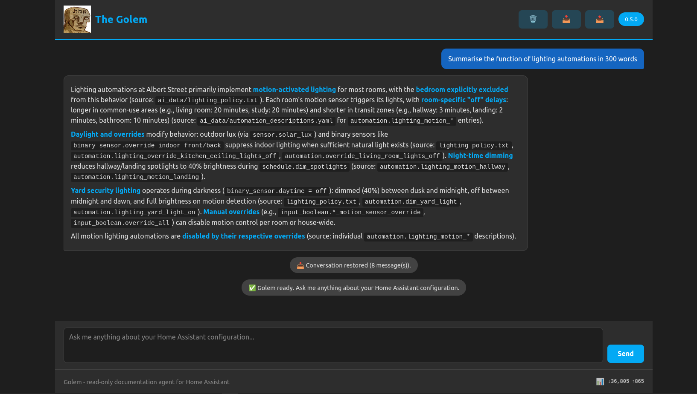

# The Golem

This is the repository for The Golem, an app (add-on) which creates documentation for your Home Assistant instance by scanning its configuration.

# Installation

## Home Assistant Add-on (Supervisor Required)

1. Navigate to Settings → Add-ons → Add-on Store
2. Click ⋮ → Repositories
3. Add: `https://github.com/jackjourneyman/Golem`
4. Find "The Golem" and click Install
5. Configure and Start

Visit the [documentation page](https://github.com/jackjourneyman/Golem/blob/main/golem/DOCS.md) and the [discussions page](https://github.com/jackjourneyman/Golem/discussions/1) for more information
